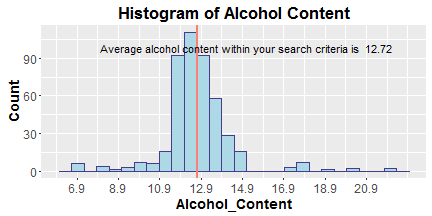
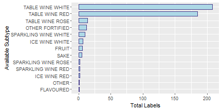

---
title       : Welcome to BC Liquor Store 
subtitle    : Developing Data Product Project
author      : Jennifer Yueh
job         : 
logo        : 
framework   : io2012        # {io2012, html5slides, shower, dzslides, ...}
highlighter : highlight.js  # {highlight.js, prettify, highlight}
hitheme     : default      # 
widgets     : [mathjaz, quiz, bootstrap, shiny, interactive]           
mode        : selfcontained # {standalone, draft}
knit        : slidify::knit2slides
ext_widgets: {rCharts: [libraries/nvd3]}
--- 

## <h1 style="text-align:center;font-weight:bold">Introduction</h1> 
 
 
This shiny application aims to help you get a quick glimpse of your <b>product inventory</b> through the power of Shiny's automatic UI updates. 

 
It has two main features:

* <b>User friendly input controls </b>
* <b>Instant and reative output</b>

--- &twocol table.mytable

## <h1 style="text-align:center;font-weight:bold">Input Controls</h1> 
 

*** =left
### You decide where to look by ...

* Setting price range by moving the slider or 
* Picking product type: WINE, BEER, SPIRITS or REFRESHMENT
* Selecting country of origin from the drop down list

*** =right

### Our app searches through the data ...
<!-- html table generated in R 3.2.2 by xtable 1.8-0 package -->
<!-- Sun Jan 31 17:28:40 2016 -->
<table class:mytable>
<tr> <th>  </th> <th> Type </th> <th> Subtype </th> <th> Name </th>  </tr>
  <tr> <td align="right"> 1 </td> <td> WINE </td> <td> TABLE WINE RED </td> <td> COPPER MOON - MALBEC </td> </tr>
  <tr> <td align="right"> 2 </td> <td> WINE </td> <td> TABLE WINE WHITE </td> <td> DOMAINE D'OR - DRY </td> </tr>
  <tr> <td align="right"> 3 </td> <td> WINE </td> <td> TABLE WINE RED </td> <td> SOMMET ROUGE </td> </tr>
  <tr> <td align="right"> 4 </td> <td> WINE </td> <td> TABLE WINE WHITE </td> <td> MISSION RIDGE - PREMIUM DRY WHITE </td> </tr>
  <tr> <td align="right"> 5 </td> <td> WINE </td> <td> TABLE WINE RED </td> <td> ZINFANDEL - BIG HOUSE CARDINAL ZIN </td> </tr>
  <tr> <td align="right"> 6 </td> <td> WINE </td> <td> TABLE WINE RED </td> <td> LE VILLAGEOIS RED - CELLIERS LA SALLE </td> </tr>
   </table>

--- &twocol 

## <h1 style="text-align:center;  font-weight:bold">Instant and reactive output</h1> 
 

*** =left

### Notice how ...
* All the related data are automatically re-evaluated and refreshed
* Simply click a tab such as Plot or Tally to see corresponding histogram and data display based on your search criteria

*** =right
### An output plot

--- 

## <h1 style="text-align:center;font-weight:bold">And another Output</h1> 
 
 

<!-- html table generated in R 3.2.2 by xtable 1.8-0 package -->
<!-- Sun Jan 31 18:23:06 2016 -->
<table class="mytable">
<tr> <th>  </th> <th> Type </th> <th> Name </th> <th> Alcohol_Content </th> <th> Price </th>  </tr>
  <tr> <td align="right"> 1 </td> <td> WINE </td> <td> BABY DUCK </td> <td align="right"> 6.90 </td> <td align="right"> 6.97 </td> </tr>
  <tr> <td align="right"> 2 </td> <td> WINE </td> <td> BABY CANADIAN SPARKLING </td> <td align="right"> 6.90 </td> <td align="right"> 6.97 </td> </tr>
  <tr> <td align="right"> 3 </td> <td> WINE </td> <td> BABY DUCK </td> <td align="right"> 6.90 </td> <td align="right"> 13.00 </td> </tr>
  <tr> <td align="right"> 4 </td> <td> WINE </td> <td> BABY CANADIAN SPARKLING </td> <td align="right"> 6.90 </td> <td align="right"> 13.00 </td> </tr>
  <tr> <td align="right"> 5 </td> <td> WINE </td> <td> LA SCALA SPUMANTE </td> <td align="right"> 7.00 </td> <td align="right"> 6.97 </td> </tr>
  <tr> <td align="right"> 6 </td> <td> WINE </td> <td> LA SCALA SPUMANTE </td> <td align="right"> 7.00 </td> <td align="right"> 13.00 </td> </tr>
   </table>

 
To see more, go to https://github.com/roseapple0803/LiquorStore

